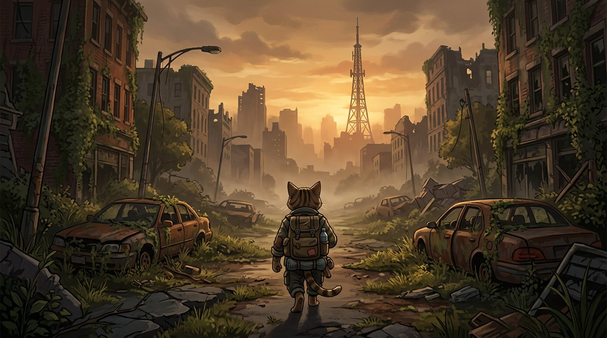

# 失落区 · LOST ZONE 桌面版（Electron）

网页版保持 1.4MB 轻量；**桌面版 = 网页游戏 + 1GB+ 高清资源包 + 桌面运行时**。



## 体积对比

| 版本 | 体积 | 说明 |
|---|---|---|
| 网页单文件版 (`dist-single/index.html`) | ~1.4 MB | 零安装浏览器即玩 |
| 桌面版资源包 (`resources/`) | **~1.05 GB** | 完整 OST + 2K 纹理 + 音效（`tools/gen_assets.py` 一键生成） |
| 桌面发行包 (`release/`) | **1.2 GB+** | 资源包 + Electron 运行时（约 200MB） |

## 快速开始（用户本机）

### 一键启动（开发）
```bash
cd lostzone/desktop
npm install                 # 下载 Electron 运行时（首次约 120MB）
npm run gen:assets          # 生成 1GB+ 资源（约 25 分钟，可复现）
npm start                   # 启动桌面版（启动画面 → 进入游戏）
```

### 一键打包发行版（1.2GB+）
```bash
# Linux / macOS
SIZE=1G ./build-release.sh          # 完整 1GB 资源包 → release/LostZone-Desktop-*.zip
SIZE=150M ./build-release.sh        # 快速档验证

# Windows（在 PowerShell/cmd 中）
build-release.bat                   # 完整档 → LostZone-Desktop-win-x64.zip
set SIZE=150M && build-release.bat  # 快速档
```

脚本流程：npm install(带 Electron 补下载) → 生成资源 → 同步游戏本体 → electron-builder dir → zip。
解压后运行 `linux-unpacked/失落区-LostZone`（Windows 为 `win-unpacked/失落区-LostZone.exe`）。

### 云端打包（可选）
沙盒/CI 若下载不了 Electron 二进制，可让 GitHub Actions 打包：
把 `docs/actions-desktop-build.yml.template` 复制为 `.github/workflows/desktop-build.yml` 推送后触发
（需 GitHub App/PAT 具备 `workflows` 权限；模板会直接在 runner 上产出并上传 Release）。

## 资源构成（`resources/`，由生成器产生，不入 git）

- `audio/bgm/01.wav …` 完整 OST：44.1kHz 16bit 立体声，每首 4 分钟 ≈ 40MB；`--size 1G` 生成 22 首 ≈ 890MB
- `audio/sfx/` 120 个程序合成音效
- `art/tex/` 18 张 2048×2048 程序绘制高清地表/墙体纹理（草地/石板/砖墙/木地板/混凝土/金属/沥青/锈金属/瓷砖）
- `art/concept_01.jpg…` 6 张 2K 概念背景（废墟天际线）

生成器零外部依赖（仅 Pillow），固定 seed 全可复现：

```bash
python3 tools/gen_assets.py --size 1G      # 完整 1GB
python3 tools/gen_assets.py --size 150M    # 快速验证（约 80 秒）
python3 tools/gen_assets.py --size 0 --report
```

## 架构

```
desktop/
  main.js          Electron 主进程：lza:// 只读协议 → resources/（打包后仍可读）
  preload.js       OST 播放器（Audio 元素，桌面专属 API window.desktop）
  app/splash.html  启动画面（2K 概念图 + 标题，播放 OST 预览）
  app/index.html   游戏本体（由 lostzone/dist-single/index.html 复制，`npm run copy:game`）
  resources/       1GB+ 高清资产（gitignore，生成器产出）
  tools/           gen_assets.py 资源生成器 · copy_game.mjs 副本同步器
```

网页版无需任何改动；桌面版通过 `lza://` 协议注入资源，`window.desktop.playBgm(i)` 可在游戏内换曲。

## 备注

- 沙盒（CI）因出口网络限制无法下载 Electron 二进制，`release/` 需在用户本机构建（`npm install` 会自动下载）；资源生成器已在本地验证可产出 155MB（150M 档）资源。
- 体积策略：音频用未压缩 WAV 撑起真实内容（OST 本来就该是无损），贴图用 2K PNG；后续可加 4K 角色立绘与逐帧动画序列进一步突破 2GB。
